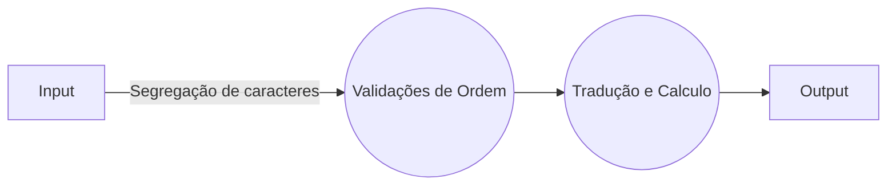

# Bem vindo ao APP de tradução de números decimais em kwegonian

Este repositório é feito para gerar um APP de tradução dos números em kwegonian, que são escrito no padrão romando porem com os os valores escritos com caracteres diferentes. 
| kil     |  I  |
| jin     | V | 
| pol     | X |
| kilow | L |
| jij      | C | 
| jinjin | D |
| polsx | M |

# Instalando
*go get -v github.com/KaueBonfim/desafio-golang-translate*

# Organização do Projeto

.
|_api
|_entrypoins
|_test
|_translate
|_web
|_app.go

## Responsabilidades


### api

Cria um entrypoint em uma API rest, na path 0.0.0.0:5080/translate.

### entrypoins

Organiza das entradas recebidas na linha de comando e executa as opções, que podem ser:

>*help*:Opção de socorro do app pela linha de comando.

>*cmd(Defalut/padrão)*: Opção para fazer a tradução pela linha de comando.

>*api*: Opção para gerar uma API com metodo post na porta 5080 nco caminho /translate.

>*web*: Opção abre a uma pagina com um form simples para fazer uma tradução pela pagina Web.

### test

Teste da tradução dos caracteres passados para alfanumérico.

### web

Cria um entrypoint web, na path 0.0.0.0:8080/translate.


# Fluxo de tradução

O APP recebe uma entrada em kwegonian, verifica qual caracteres são caracteres alfanumericos em kwegonian, e retorna uma saida numerica caso exista caracteres validos.




# Execução

## Pre requisitos
>Para a execução primeiro precisamos instalar as dependências, execute dentro da pasta $GOPATH/src/github.com/KaueBonfim/desafio-golang-translate.

> *go get -v ./...*

## Construindo o Arquivo
>Dentro da pasta do projeto execute para construir um executável

>*go build app.go*

## Ou Instale o APP 
>Dentro da pasta do projeto execute para construir um executável

>*go install -v ./..*


## Vamos executá-lo

### Pela linha de comando 
*app cmd ou app*
Você recebera para escrever uma entrada:

*Input:*
Escreva um valor em Kwego e pressione ENTER.

#### Exemplo:
*app*
*Input: polsx polsx pol jin kil 6*

**Saida:**

*Output is => 2016*
*No translate your char => [6]*

### Pela API
*app api*
Execute um método POST na API com o seguinte corpo

#### Exemplo:
```
curl --header "Content-Type: application/json"/
   --request POST   /
   --data '{"input":"polsx polsx pol jin kil"}'/
   http://localhost:5080/translate
```

**Saida:**

*{"numbers":[1000,1000,10,5,1],"input":"polsx polsx pol jin kil","output":2016,"invalids":null}*

### Pela WEB
*app web*
Você uma entrada pagina web, acesse o navegador no caminho :8080/translate e insira o valor no campo de Input, envie o formulário e recebera o Output.

*Obs.: Somente faz a leitura dos caracteres Validos*
